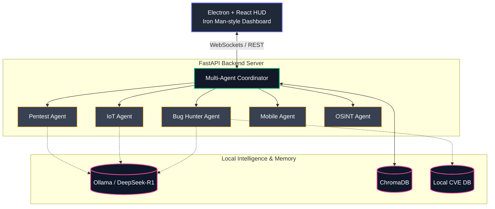

# FRIDAY Omega — Autonomous AI Cybersecurity Pentest Agent

> **Status:** 🚧 Active R&D / Prototype
> 
> **Research Problem:** Fully autonomous AI pentesting agents pose severe OPSEC risks by blindly executing payloads outside predefined bounds.
> **Working Hypothesis:** A multi-agent orchestration engine running purely local models can achieve heuristic penetration testing parity while being structurally constrained by a hard-coded "Authorization-First" API firewall.
> **Research Goal:** Prove 100% boundary adherence in agentic workflows while maintaining sub-2s offline CVE correlation speeds.

An autonomous, agentic AI cybersecurity penetration testing assistant powered by local LLMs (Ollama). FRIDAY Omega orchestrates Nmap, Metasploit, ADB, and OSINT tools through a multi-agent coordination engine with a hard-coded **Authorization-First** safety protocol.

## 🔴 Live System Demo

*Interactive Mission Dashboard reporting backend health stats and system diagnostics.*

## Architecture



## Core Features

- **Multi-Agent Orchestration:** Pentest, IoT, Bug Hunter, Mobile, and OSINT agents coordinated through a central mission controller
- **Authorization-First Protocol:** Hard-coded safety firewall — no network scans outside user-defined scope boundaries
- **Local LLM Reasoning:** All AI logic runs locally via Ollama (DeepSeek-R1), zero cloud dependencies
- **CVE Correlation Engine:** Offline cross-referencing of live scan reconnaissance (open ports, service versions) against local vulnerability databases
- **RAG Memory System:** ChromaDB vector database for persistent operational memory and context retrieval
- **Full HUD Frontend:** Electron + React dashboard with real-time mission status, agent coordination view, and remediation reporting

## Technical Stack

- **AI/LLM:** Ollama (DeepSeek-R1, LLaVA), ChromaDB Vector DB
- **Backend:** Python, FastAPI, SQLite
- **Frontend:** Electron, React, HTML5/CSS3
- **Security Tools:** Nmap, Metasploit, ADB, OSINT modules
- **Architecture:** Multi-agent coordination, RAG pipeline, Authorization enforcement layer

## Agents

| Agent | Capability |
|-------|-----------|
| **Pentest Agent** | Nmap scans, port enumeration, service fingerprinting, exploit suggestion |
| **IoT Agent** | Network device discovery, firmware analysis, default credential checking |
| **Bug Hunter Agent** | CVE correlation, vulnerability assessment, remediation playbook generation |
| **Mobile Agent** | ADB-based Android security testing, APK analysis |
| **OSINT Agent** | Open-source intelligence gathering, domain reconnaissance |
| **Multi-Agent Coordinator** | Mission orchestration, agent task delegation, conflict resolution |

## Safety & Ethics

This tool enforces a strict **Authorization-First** policy:
- All scan targets must be explicitly authorized by the operator
- Network boundaries are hard-coded before any reconnaissance begins
- The system refuses to execute outside defined scope — this is not a configurable setting, it is a core architectural constraint

## Setup

```bash
# 1. Clone the repository
git clone https://github.com/chahat1709/Friday-Omega.git
cd Friday-Omega

# 2. Setup standard infrastructure dependencies
npm install

# 3. Setup Python Backend Environment
cd python_backend
python -m venv .venv
source .venv/bin/activate  # On Windows use: .venv\Scripts\activate
pip install -r requirements.txt

# 4. Initialize Local Intelligence (Ollama must be installed)
ollama pull deepseek-r1
ollama pull llava

# 5. Boot the Architecture (in separate terminals)
# Terminal 1: Backend Server
python main.py

# Terminal 2: Iron Man HUD
cd ..
npm start
```

## License

Research & Educational Use
