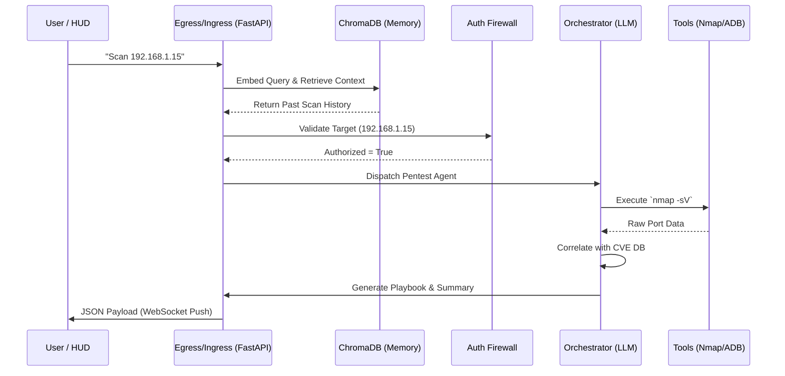

# Deep System Architecture: The Input-to-Output Pipeline

While the `README.md` provides a high-level overview of the FRIDAY Omega ecosystem, this document provides a rigorous, deep-dive technical specification of the **Input-to-Output Pipeline**. 

This pipeline governs exactly how raw user instructions (or automated sensor triggers) are safely transformed into autonomous hardware execution and final intelligence dissemination.

---

## The 7-Stage Execution Pipeline

### Stage 1: Ingress & Classification (The API Gateway)
All commands enter the system via the `FastAPI` asynchronous backend, either through REST endpoints or persistent WebSockets established by the React HUD.
- **Intent Classifier:** Before any processing occurs, a fast, lightweight classifier determines if the request is a *Hardware Query*, a *Reconnaissance Request*, or a *System Command*.
- **Sanitization:** Raw inputs are stripped of malicious prompt-injection attempts using deterministic regex bounds before touching the LLM.

### Stage 2: Memory & Context Enrichment (Retrieval-Augmented Generation)
Before routing to an agent, the system establishes context.
- The input is embedded and queried against the local **ChromaDB Vector Database**.
- The system retrieves historical context (e.g., "Has this IP been scanned before?", "Were there vulnerabilities found last time?").
- **Output:** A dense context-payload is appended to the original prompt.

### Stage 3: The Authorization-First Firewall (Constraint Enforcement)
This is the core paradigm shift of FRIDAY Omega.
- **Scope Verification:** The system intercepts the prompt and parses it for target execution boundaries (IPs, URLs, local subnets).
- **Hard-Coded Block:** If the target is *not* in the pre-authorized whitelist, the pipeline **halts immediately**. It does not query the LLM to ask for permission; it triggers a hard architecture block.
- **Output:** Proceed to execution, or return a firm `AuthError` to the UI.

### Stage 4: Multi-Agent Dispatch (The Orchestrator)
Once authorized, the input hits the **Multi-Agent Coordinator**.
- Powered by a local reasoning model (**DeepSeek-R1** via Ollama).
- The Coordinator breaks the monolithic user request into granular sub-tasks.
- It dynamically spins up and assigns tasks to the specialized agents:
  - `Pentest Agent` (Network mapping)
  - `Bug Hunter Agent` (Vulnerability correlation)
  - `IoT Agent` (Subnet scraping)
  - `OSINT Agent` (Domain intelligence)

### Stage 5: Tool Execution & Raw Ingestion (Hardware Bridge)
Agents do not just generate text; they generate code and commands.
- The `Hardware Bridge` wraps the agents, taking their requested commands (e.g., an `nmap -sV -A` string) and validating the syntax.
- The command is executed directly on the host OS via `subprocess` threads.
- Raw outputs (often thousands of lines of terminal output) are captured.

### Stage 6: The CVE Correlation Engine (Deep Reasoning Loop)
Raw tool output is useless to executives. It must be translated.
- The raw output is piped back into the `Bug Hunter Agent`.
- The agent cross-references the discovered ports and service versions (e.g., `Apache 2.4.49`) against the **Local offline CVE database**.
- The LLM reasons over the findings, isolating critical vulnerabilities from false positives without ever making an external internet call.

### Stage 7: Final Synthesis & Output Routing
- The insights are aggregated into a standardized JSON response.
- The final payload includes:
  - Technical Findings (for engineers)
  - Remediation Playbooks (step-by-step fix guides)
  - Executive Summaries
- **Egress:** The JSON is pushed down the WebSocket to the Iron Man React HUD, instantly updating the UI grids and triggering the voice synthesizer module.

---

## Data Flow Diagram

